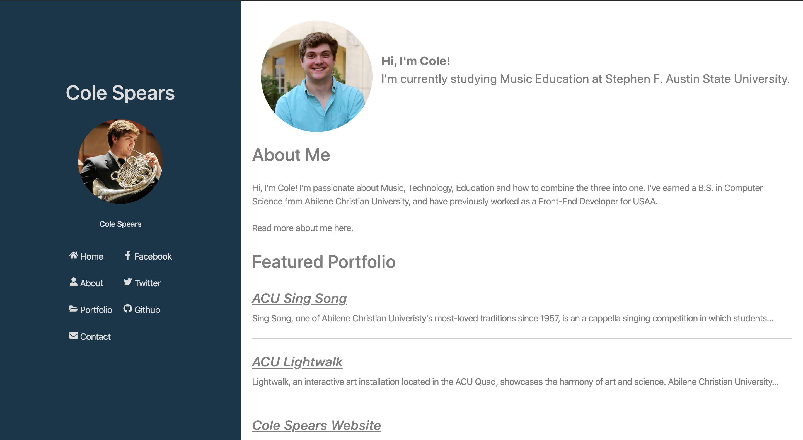

GatsbyJS is a React-based, GraphQL powered, website-generator framework. It pairs well with hosting platforms like Netlify, Github Pages, and others. It offers a fantastic community, and is geared toward beginner enthusiasts and veteran developers alike. And that isn't even the tip of the iceberg. From thousands of plugins written by an ever-growing community, to Cloud-based services on the horizion, Gatsby is looking to be a heavyweight in the React framework world. Here's what the official website has to say about Gatsby:

> GatsbyJS is a free and open source framework based on React that help developers build blazing fast **websites** and **apps** – _gatsbyjs.org_

This isn't the first time that I've used Gatsby: this previous Summer, I enrolled in a (then-free) online [Udemy course](https://www.udemy.com/course/gatsby-js-build-pwa-blog-with-graphql-and-react-wordpress/) which taught me the core concepts of Gatsby. Ready to take on the world, I created my first personal website, shown below:

Yikes.

Apart from the obvious design flaws, I was not forward-thinking in my approach. I had constrained myself from easily and efficiently providing any kind of extensibility, something contradictory to Gatsby core concepts.

So, when Gatsby first announced their "100 Days of Gatsby Challenge", I immediately thought about re-doing my website. This was fortituous, as the first written challenge was to create a blog. With my experience in React, I decided to use a [starter](https://www.gatsbyjs.org/starters/niklasmtj/gatsby-starter-julia/) to expedite the process and start providing the functionality I sought.

I sat down and created a MVP for my blog, something that I can realisitcally deliver in a week. My site must have:

- a Landing Page
- a Blog Page, showing my posts
  - 1 Blog Post (if you're reading this, then it's a success!)
- an About Page
- SEO and Google Analytics

## Day 1 - 7 Summary
Refreshing myself on Gatsby practices by following the Gatsby-provided tutorial, I used the Julia starter and started customizing from there. I easily added in several community plugings, including SEO, Google Analytics, Sharp image processing, as well as slick service embeds. From there, it was a small process to upload my site to Github Pages for hosting. All-in-all, pretty painless. and easily teachable.

I met all of my MVP plus some. Some next steps on my site are to enhance the UI using some slick transitions, use Netlify CMS to update content, as well as write more posts.

Feel free to follow me on Twitter as I continue learning Gatsby!

https://twitter.com/colekspears/status/1209148672983945216
